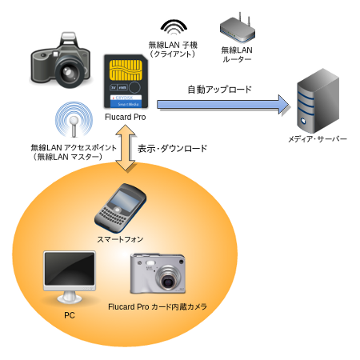
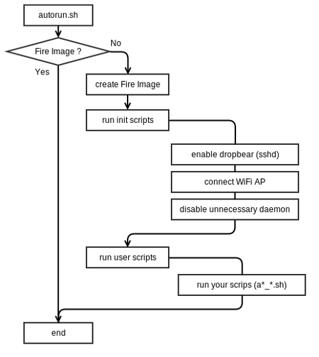

## Welcome to FLUCARD APP

FLUCARD APP is Linux server scripts for the Flucard Pro (WiFi SD card) 

## Flow

## Follow the guidelines to use application.

    * [netbuffalo's blog](http://netbuffalo.doorblog.jp/archives/4811269.html)

## License

Released under the [MIT License](http://www.opensource.org/licenses/MIT).

